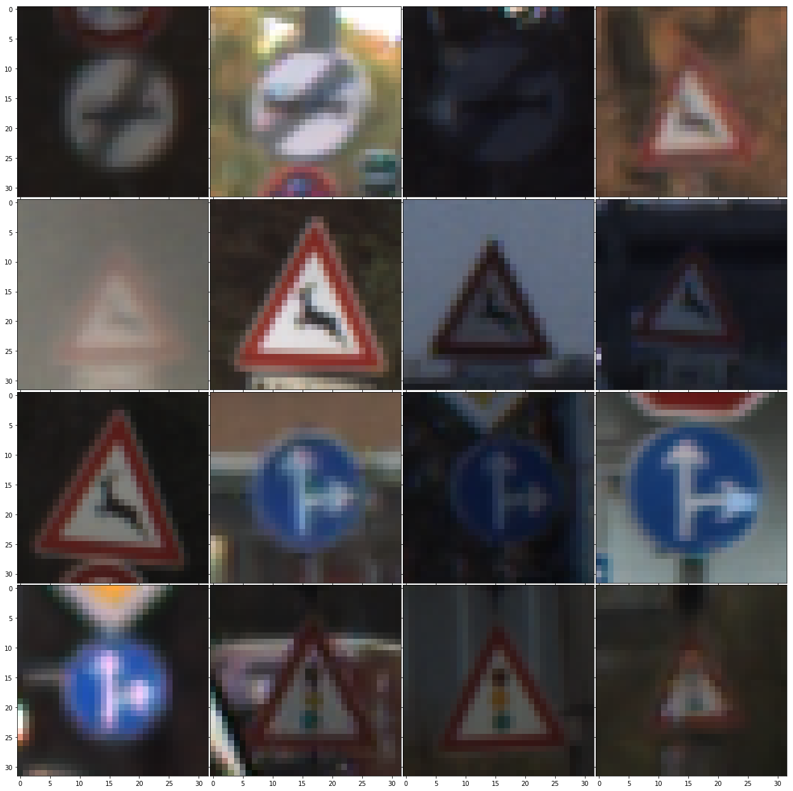

# Traffic Sign Recognition

### 1. Dataset

Loading the dataset we are presented with the following data points:

- 34799 images worth of training data
- 12630 images worth of testing images
- Each image is a color image that is 32x32 pixels with 3 channels.
- In total there are 43 different sign classes

### 2. Data visualization

Below is a grid of some of the sign images.



Looking at the images there can be seen varying different lighting types, some darker and other lighters. In other cases there are noisy backgrounds or much cleaner backgrounds. These differences added to some of the difficulty of getting a higher validation score.


## Design and Test Model Architecture

### 1. Data Preprocessing

While experimenting different types of preprocessing I found that not converting the image to gray scale worked best. The only preprocessing was to normalize the data between 0 and 1 using the following formula:

```python
def preprocess(image):
    return (image - image.min()) / (image.max() - image.min())
```
[Normalize formula found here](https://stats.stackexchange.com/questions/70801/how-to-normalize-data-to-0-1-range)

This doesn't change the image much and simply just makes the pixel values of the image better for the network to work with.

### 2. Model Architecture

For my model I used the LeNet as a starting point and first trained it as is, but found that it only got to about 90% accuracy. So, the next step was to make the network much wider and a little bit deeper. 

I added another layer after layer 4 that ended up have a input shape of 800, 400 and had a output of 400. The layers preceeding this were two fully connected layers with 1600 inputs and outputs that ultimately fed into this additional layer with 800 inputs. The output then became a layer that had a input of 400 and output the 43 different classes. After making these wideing and deeping of the original LeNet architecture I was able to get 96.5% accuracy on the validation set and 100% accuracy on the sign images I downloaded off the internet.

### 3. Training the Model

For training I found a batch size of 128 along with a learning rate of 0.001 worked well with the AdamOptimizer. I trained for 50 epochs as I found that any more the accuracy didn't increase and I worried there might be some over fitting, this was because the network was much deeper and wider than originally and there was not a marked increase in dataset size, this could have been avoided through data augmentation.

### 4. Final Model

The final model reached a validation accuracy of 96.5% and a test accuracy of 94.2%.

The first model that was tested was just the normal LeNet5 network. This network provided around a 90% which I knew could be higher so I modified this and added another hidden layer to make franeknstein LeNet6 of my own creation. In the model I did not add any convulutional layers or dropout and found that the I just needed to add more to the fully connected layers to get the accuracy I was able to get.

## Testing

### Downloaded Images

To further check the model I found 5 images from the internet and ran the model on them and was able to get 100% accuracy.

I'll investigate one of the images here:


The above image was correctly identifier as "Go straight or right". The following are the top 5 softmax predictions:

```
Label: Go straight or right Probability: 45.14796447753906
Label: Children crossing Probability: 9.641637802124023
Label: Dangerous curve to the right Probability: 9.202371597290039
Label: Keep right Probability: 6.815297603607178
Label: Ahead only Probability: 6.377190113067627
```

In the case of this image the model predicted the correct label overwhelmingly compared to the next top prediction. This pattern also followed for most of the other downloadeded images. I think the images were very close to the original dataset and thus the model was very good at predicting this. Another reason was the lighting was very good and the backgrounds were very clearly seperated, so in some ways they were fairly ideal for the model to predict, but it gives me confidence in the models ability to predict on totally unseen images.